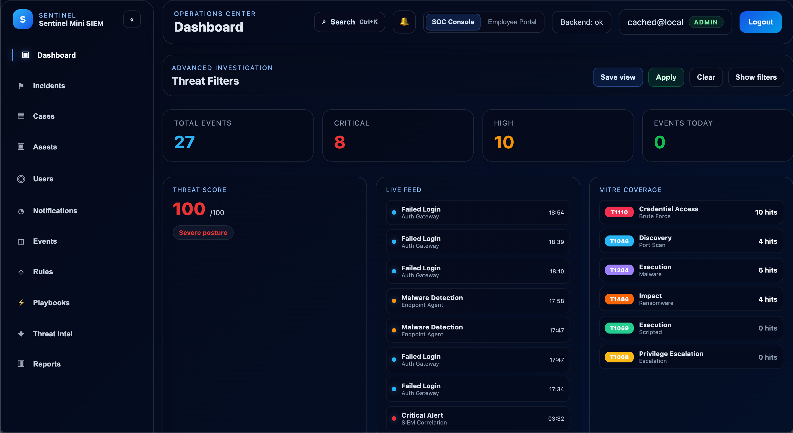
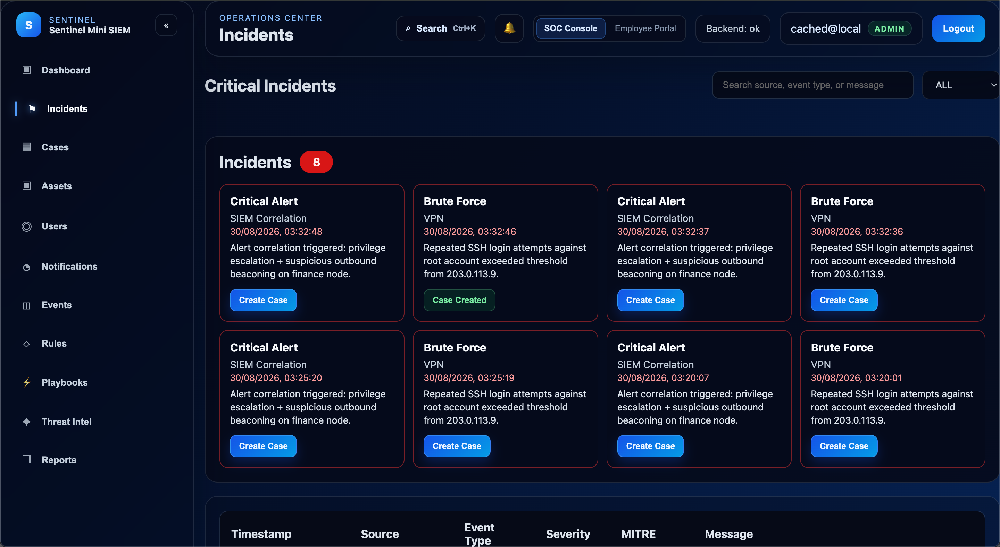
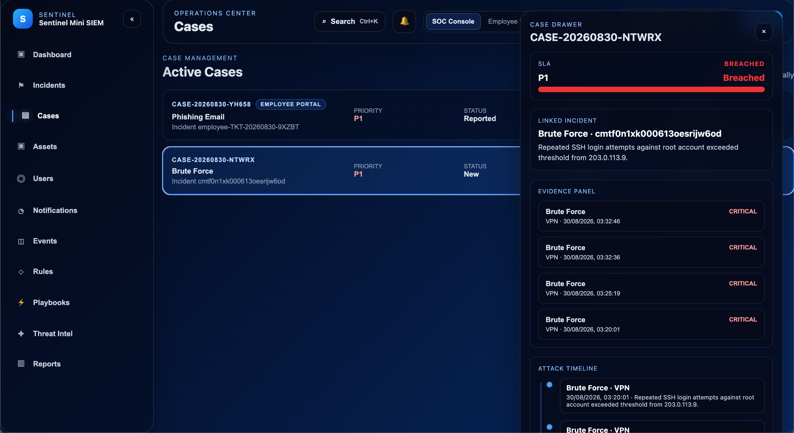
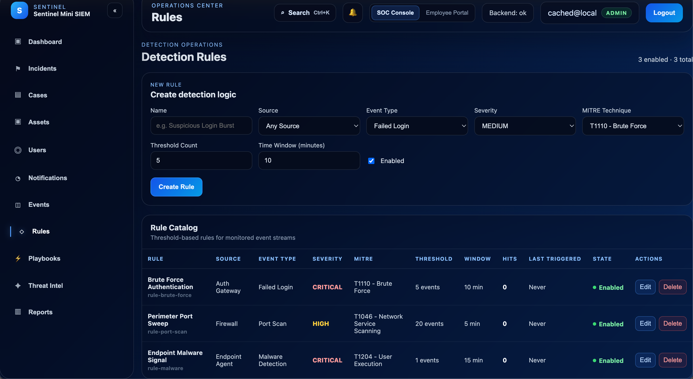
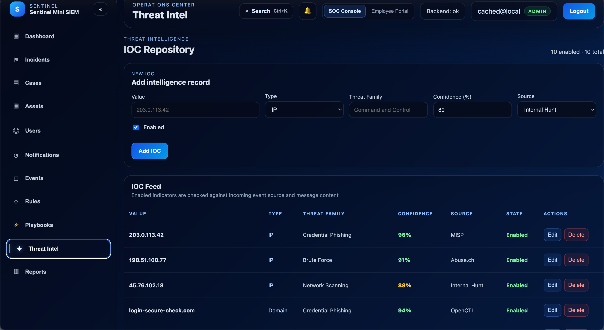
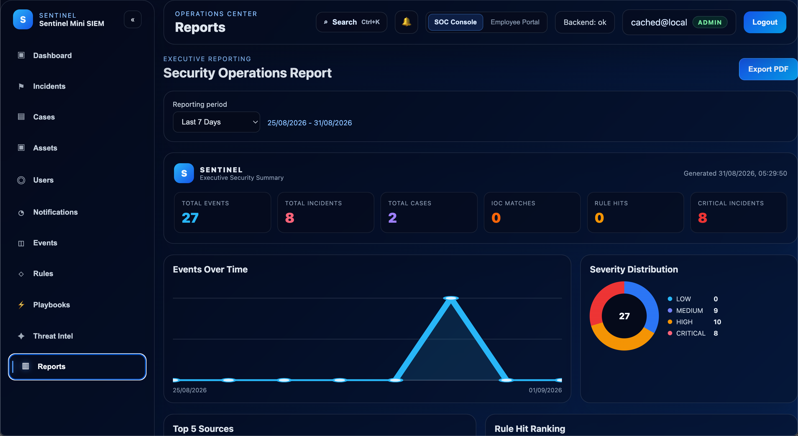

# Sentinel Mini SIEM v2.0.0

A commercial-style **Security Operations Center (SOC)** simulation platform built with **React, TypeScript, Express, Prisma, and SQLite**.

Sentinel Mini SIEM replicates the workflow of a modern SOC by combining real-time monitoring, incident response, threat intelligence, SOAR automation, executive reporting, and role-based access control into a single application.

---

## Features

### SOC Operations

* Real-time SOC Dashboard
* Live Event Monitoring (SSE)
* Incident Management
* Case Management
* Investigation Workspace
* MITRE ATT&CK Mapping

### Detection & Intelligence

* Detection Rules Engine
* IOC Repository
* Threat Intelligence Correlation
* Critical Incident Generation
* Global Search & Investigation Pivot

### Security Operations

* SOAR Playbooks
* Asset Inventory
* User Directory
* Employee Self-Service Portal
* Notifications & SLA Tracking
* Audit Log

### Administration

* Role-Based Access Control
* Enterprise Settings
* Executive Reports
* Glassmorphism Dark UI

---

## Architecture

The project follows a lightweight monorepo architecture.

```text
client/      React + Vite + TypeScript
server/      Express API + Prisma
shared/      Shared types
prisma/      SQLite database
```

### Runtime Flow

1. User authenticates into the SOC.
2. Backend validates JWT credentials.
3. Security events are stored in SQLite.
4. Events stream to the dashboard using Server-Sent Events.
5. Detection rules and IOC correlation generate critical incidents.
6. Analysts investigate, create cases, and execute SOAR playbooks.

---

## Tech Stack

| Layer          | Technology            |
| -------------- | --------------------- |
| Frontend       | React 19 + TypeScript |
| Build          | Vite                  |
| Backend        | Node.js + Express     |
| ORM            | Prisma                |
| Database       | SQLite                |
| Authentication | JWT                   |
| Security       | bcrypt                |
| Validation     | Zod                   |
| Streaming      | Server-Sent Events    |

---

## Screenshots

### SOC Dashboard



### Incident Center



### Investigation Workspace



### Detection Rules



### Threat Intelligence



### Executive Reports



---

## Installation

Clone the repository.

```bash
git clone https://github.com/Tunar707/sentinel-mini-siem.git
cd sentinel-mini-siem
```

Install dependencies.

```bash
npm install
```

Generate Prisma client.

```bash
npx prisma generate
```

Start the backend.

```bash
npm run dev --workspace server
```

Start the frontend.

```bash
npm run dev --workspace client
```

Client:

`http://localhost:5173`

Server:

`http://localhost:3000`

---

## Default Accounts

| Role | Email | Password |
|--------|------------------|-------------|
| Admin | `cached@local` | `admin123` |
| Analyst | `analyst@local` | `analyst123` |
| Employee | `employee@local` | `employee123` |

---

## Project Status

**Release:** v2.0.0

Stable portfolio release featuring SOC monitoring, incident response, threat intelligence, SOAR automation, reporting, RBAC, and enterprise administration.

---

## License

MIT License
